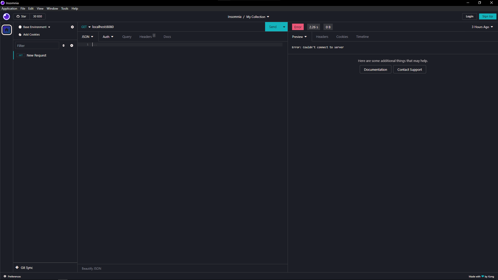

# Horizon for Insomnia

Based on Visual Studio Code Horizon theme.
[Link to site](https://horizontheme.netlify.app/)

## Preview

## Install

1. Open Insomnia
2. Open `Plugins` tab in `Preferences`
3. Search `insomnia-plugin-horizon`
4. Click on Install Plugin
5. Apply theme from `Themes` tab
